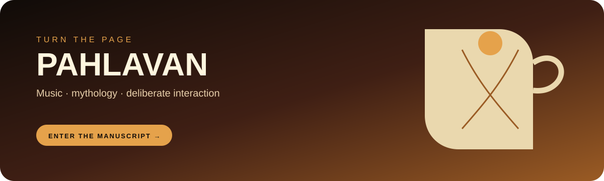

  

  <h1>PAHLAVAN</h1>
  
<strong>A digital musical manuscript inspired by Persian mythology, epic storytelling, and the theatre of the web.</strong>

  

    <a href="https://soheil-aghayani.github.io/pahlavan/"><strong>Enter the manuscript →</strong></a>
  

  

    
    
    
  

---

## The idea

Pahlavan is an interactive album shaped like an ancient manuscript. Visitors turn pages, discover tracks, read short stories, and move through a dark, cinematic world of dust, embers, and music.

It is an experiment in making a web page feel like an object.

## The experience

- A 3D page-flipping book built with CSS transforms
- Data-driven track metadata and story content
- A focused audio player with progress and seek controls
- Canvas particles for floating dust and embers
- Cinematic imagery, custom type, and high-contrast reading surfaces
- No framework or build step

## Project map

| File | Role |
| --- | --- |
| index.html | Application shell and manuscript structure |
| style.css | 3D layout, typography, transitions, and atmosphere |
| script.js | Page logic, audio synchronisation, and interaction |
| data.js | Track, story, and album metadata |
| assets/images/ | Covers, backgrounds, and page artwork |
| assets/songs/ | Album audio tracks |

## Run locally

~~~bash
git clone https://github.com/Soheil-Aghayani/pahlavan.git
cd pahlavan
python -m http.server 8080
~~~

Then open http://localhost:8080.

  Ancient atmosphere, modern browser primitives.

